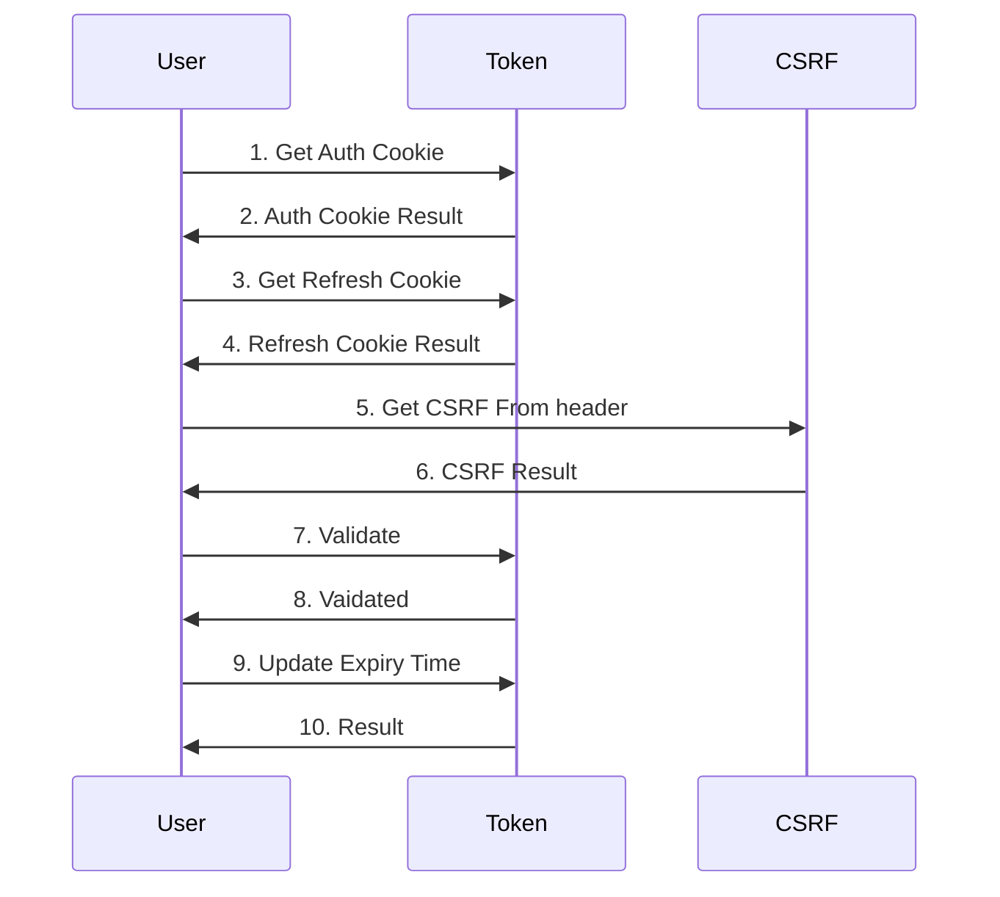
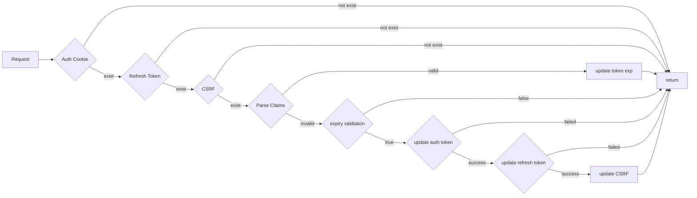

###Auth Flow
---

#### Authhentication

```mermaid
sequenceDiagram
    participant User
    participant Token
    participant CSRF

    User ->> Token: 1. Get Auth Cookie 
    Token ->> User: 2. Auth Cookie Result

    User ->> Token: 3. Get Refresh Cookie
    Token ->> User: 4. Refresh Cookie Result

    User ->> CSRF: 5. Get CSRF From header
    CSRF ->> User: 6. CSRF Result

    User ->> Token: 7. Validate
    Token ->> User: 8. Vaidated

    User ->> Token: 9. Update Expiry Time
    Token ->> User: 10. Result
   
```
 

---

 

#### Authorization Flow

```mermaid
graph LR
    a[Request] --> b{Auth Cookie}
    b --> |exist| c{Refresh Token}
    b --> |not exist| return

    c --> |exist| d{CSRF}
    c --> |not exist| return

    d --> |exist| e{Parse Claims}
    d --> |not exist| return

    e --> |valid| f[update token exp]
    f --> return
    e --> |invalid| g{expiry valdiation}

    g --> |true| h{update auth token}
    g --> |false| return

    h --> |success| i{update refresh token}
    h --> |failed| return

    i --> |success| j[update CSRF]
    i --> |failed| return

    j --> return


    

```

