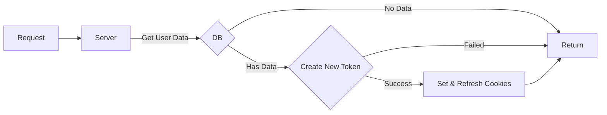
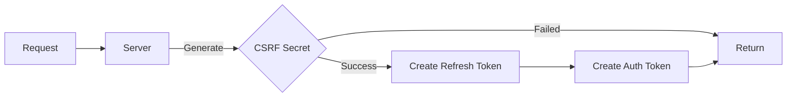
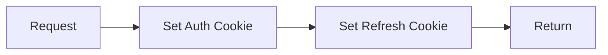

###Login Flow
---

#### Login



---

#### Create Token

<br/>
1. CSRF using Random number


---

#### Set & Refresh Cookies


---

#### Create Refresh Token
````mermaid
graph LR
    a[request] --> |generte| b[expity time]
    b --> |store| c{refresh token}
    c --> |success| d[generate token claim]
    c --> |failed| return

    d --> f[sign token]
    f --> return
````


---

#### Create Auth Token
````mermaid
graph LR
    a[request] --> |generte| b[expity time]
    b --> |generte| d[token claim]

    d --> f[sign token]
    f --> g[return]
````

---
#### Store Refresh Token
````mermaid
graph LR
    a[request] --> |generte| b{random string}
    b --> |success| c{Is Valid}
    b --> |failed| return

    c --> |valid| d[store]
    c --> |invalid| b

    d --> return

````